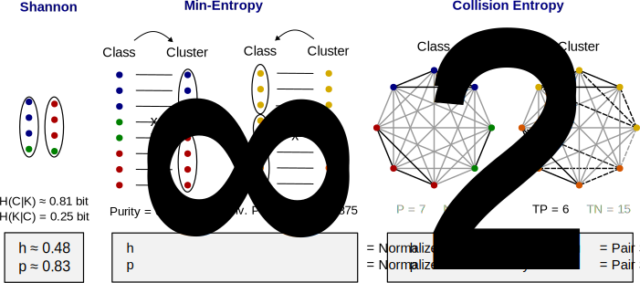

[](https://github.com/andim/clustereval/blob/master/LICENSE)
[](https://pypi.python.org/pypi/clustereval)
[](https://clustereval.readthedocs.io/en/latest/?badge=latest)
[](https://github.com/qimmuno/clustereval/actions/workflows/ci.yml)

# ClusterEval: External Clustering Validation by the Homogeneity-Parsimony Trade-Off

ClusterEval is a lightweight package for external clustering validation.

ClusterEval provides reference implementations for the homogeneity-parsimony scores proposed in [Tiffeau-Mayer 2026](TBD). Evaluation of clustering quality on these two objectives provides a unified framework for assessing clustering agreement with ground truth class labels.

The package also provides set-matching variants of the homogeneity and parsimony scores, called normalized purity, and normalized inverse purity. These scores fix the definition of purity and inverse purity so that the full range of [0, 1] is attainable. The pair-based equivalents of these scores are pair specificity and pair sensitivity, exactly the familiar binary classifier metrics used by the receiver operating characteristic (ROC) curve.

| Validation Approach | Criterion 1 | Criterion 2 | Entropy measure |
| --- | --- | --- | --- |
| Information-theoretic | Homogeneity Score | Parsimony Score | Shannon Entropy |
| Set-matching | Normalized Purity Score | Normalized Inverse Purity Score | min-Entropy |
| Pair-counting | Pair Specificity | Pair Sensitivity | Collision Entropy |



All scores are implemented in a way that is compatible with evaluation metrics defined in [Scikit-learn](https://scikit-learn.org/stable/modules/clustering.html#clustering-evaluation)'s `sklearn.metrics` to allow easy replacement within existing pipelines.

## Installation

ClusterEval can be installed via pip:

`pip install clustereval`

The package depends on `numpy` and `scikit-learn`.

## Documentation and examples

API documentation is provided through docstrings. 

Jupyter example notebooks can be found in the `examples` folder:

- [Homogeneity and parsimony](https://github.com/qimmuno/clustereval/blob/main/examples/01_homogeneity_parsimony.ipynb)
- [Other trade-offs](https://github.com/qimmuno/clustereval/blob/main/examples/02_other_trade_offs.ipynb)
- [Feature selection](https://github.com/qimmuno/clustereval/blob/main/examples/03_feature_selection.ipynb)
- [Algorithm comparison](https://github.com/qimmuno/clustereval/blob/main/examples/04_algorithm_comparison.ipynb)

You can create a local copy of the API documentation in the docs folder by running:

```bash
make html
```

All metrics require non-empty label arrays of equal length and raise `ValueError` otherwise.

## Support and contributing

For bug reports and enhancement requests use the [Github issue tool](http://github.com/qimmuno/clustereval/issues/new), or (even better!) open a [pull request](http://github.com/qimmuno/clustereval/pulls) with relevant changes.

When preparing a pull request, please run the testsuite using `pytest` to ensure none of the existing functionality breaks.
